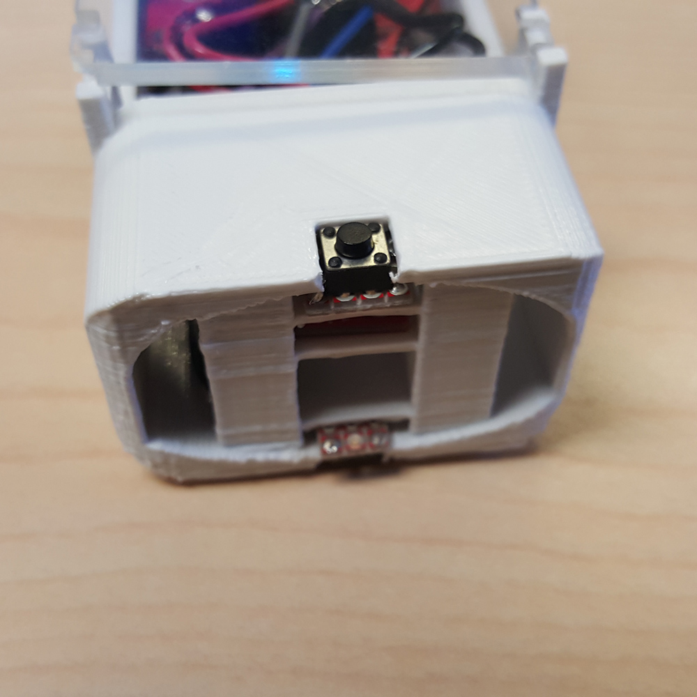
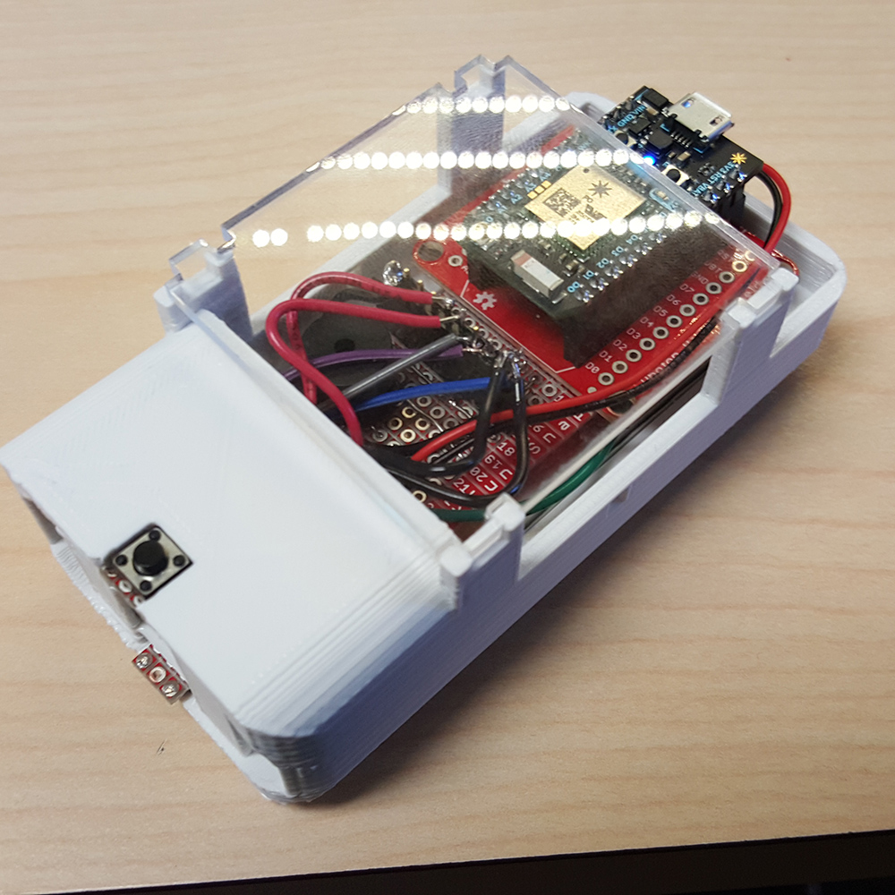
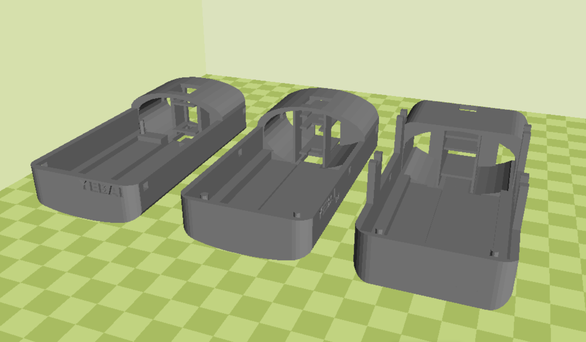

# HCIN720-IA3
For the working files of assigment 3, course HCIN720

This 3D printing project is aiming for creating a hand hold box that contains the electric parts, the Photon and the battery. 
I was trying to make the case compact and confortable in hand. In order to achive that, the cricus borad and the space in the box 
is specailly designed, after 7 prototypes. A speaker and necessary code is added to the Photon, which will make a beep when the spaceship dies.

Cloud02 page address: https://rawgit.com/YebaiZhao/HCIN720-IA3/master/cloud_02/cloud_02.html

3D models evolution, left to right = old to new.
